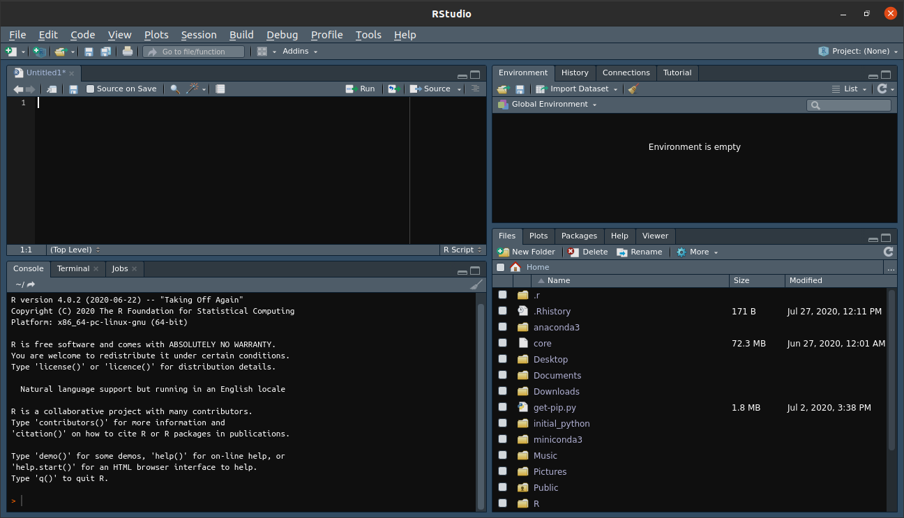
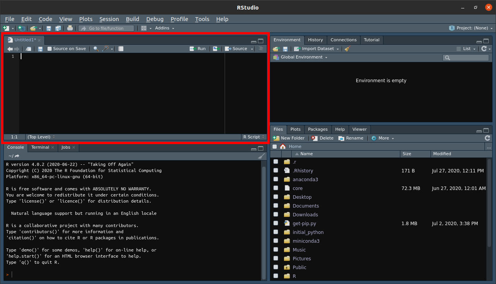
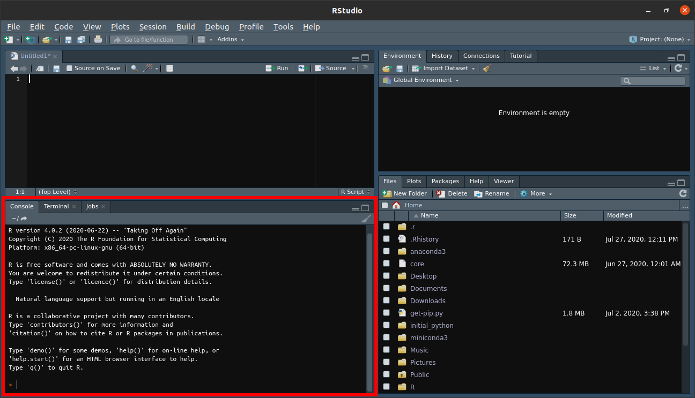
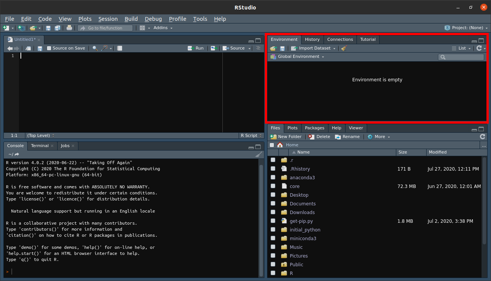
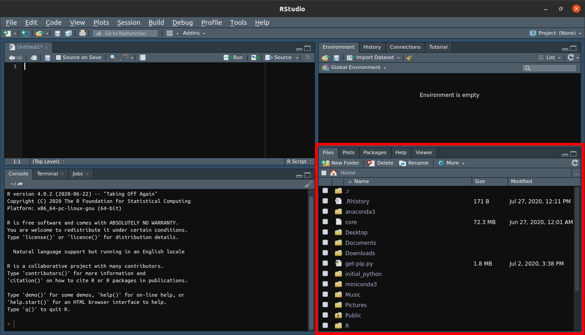
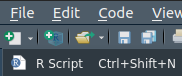
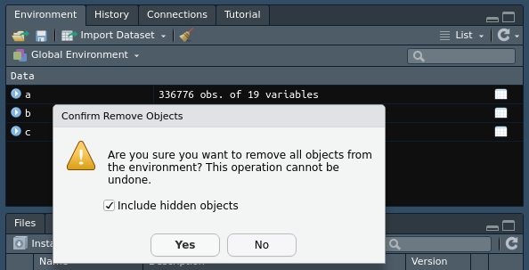
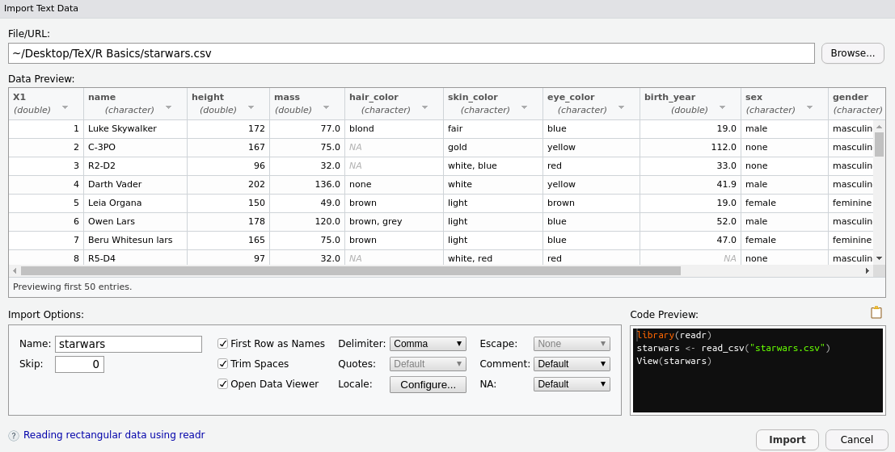

```{r setup, include=FALSE}
library(tidyverse)
library(nycflights13)
library(knitr)
library(fontawesome)

# Write hook for setting output limits for code chunks
hook_output <- knit_hooks$get("output")
knit_hooks$set(output = function(x, options) {
  lines <- options$output.lines
  if (is.null(lines)) {
    return(hook_output(x, options))  # pass to default hook
  }
  x <- unlist(strsplit(x, "\n"))
  more <- "..."
  if (length(lines)==1) {        # first n lines
    if (length(x) > lines) {
      # truncate the output, but add ....
      x <- c(head(x, lines), more)
    }
  } else {
    x <- c(more, x[lines], more)
  }
  # paste these lines together
  x <- paste(c(x, ""), collapse = "\n")
  hook_output(x, options)
})
```

name: r-basics
class: left, middle, inverse
background-image: url(https://images.unsplash.com/photo-1505413687799-90481dfc0203?ixlib=rb-1.2.1&ixid=eyJhcHBfaWQiOjEyMDd9&auto=format&fit=crop&w=2550&q=80)
background-size: cover

# R Basics

## (for those learning Stata)

.large[Isaac Baumann - `r Sys.Date()`]

---

class: middle, center, inverse

# What is R?

---

class: center, middle

<center></center>

R is an open-source statistical analysis programming language

--

Lots of tools for many types of statistical analyses

--

Flexible, highly-customizable graphics

--

Become very popular in last ~10 years

---

# Why use R?

Personally, I prefer R but both have pros and cons:

--

<br/><br/>

.pull-left[
  
  <center></center>

  - Ready out-of-the-box
  - Pay-to-play: performance limited by pay tiers
  - Economists, sociologists, some epidemiologists (this is changing)
  - Better table creation functions
  - Stata is much friendlier for econometrics

]

--

.pull-right[
  
  <center></center>

  - Steeper learning curve, but more customizable
  - Free: performance only limited by your computer
  - Statisticians, data scientists
  - Miles better than Stata for graphs
  - Better tools for data cleaning
  
]

---

# Coding: general comments

--

<p style="color:#FF0000; font-size: 32px"> Learning a programming language is <b>not</b> like learning a foreign language </p>

--

I will assume you have <b>no</b> previous coding experience (if you don't, that's great!)

--

If you do have some previous experience:

--

- Stata is like SAS in some ways

--

- R is more like Python, it also might make sense if you've used SQL

--

Even if you don't like R, try to learn it: R is more like other languages than Stata is

---

# Let's install R!

We'll be downloading two things:

--

.pull-left[

  ## "Base" R
  
  
  
  This is the actual "language"
  
  <br/>
  Install R from [the R Project](https://cloud.r-project.org/)
  
]

.pull-right[

  ## RStudio
  
  
  
  We'll use this program to write R scripts
  
  <br/>
  Install from [RStudio](https://rstudio.com/products/rstudio/download/#download)

]

<br/>
<center><p style="color:#FF0000">Install base R first, <i>then</i> RStudio.</p></center>

---

# RStudio

<center></center>

---

# RStudio

<center></center>

<center><span style="color:#FF0000"><b>Source window</b></span>: where we'll write R code (scripts)</center>

---

# RStudio

<center></center>

<center><span style="color:#FF0000"><b>Console window</b></span>: where R outputs will show when we run code</center>

---

# RStudio

<center></center>

<center><span style="color:#FF0000"><b>Environment window</b></span>: lists the datasets we're using</center>

---

# RStudio

<center></center>

<center><span style="color:#FF0000"><b>Miscellaneous window</b></span>: shows plots, folders, help pages, etc.</center>

---

# Hello, world!

Try it out!

In the upper left-hand corner, click the <span style="color:green"><b>green</b></span> plus icon and pick "R Script"

<center></center>

--

In the new source window, type:

```{r eval=FALSE, tidy=FALSE}
print("Hello world!")
```

--

Then run it! Click to the left of the code (where the number 1 is) and:

- click `Run` on the source window, <i><b>or</b></i>
- hit `Ctrl+Enter`

---

# Hello, world!

Congrats, you just wrote an R script!

<center></center>

---

# How we use R

--

<center></center>

Think of <b>data</b> like <b>raw construction materials</b>

--

To build a house, we need <b>tools</b>: in R<sup>1</sup>, these are called <b>packages</b>

--

To store our <b>tools</b> we need a <b>toolbox</b>: in R<sup>1</sup>, this is called the <b>library</b>

--

To get our <b>tools</b>, we need to go to <b>Lowe's</b>: in R, this is called <b>CRAN</b><sup>2</sup>

</br>
.footnote[

[1] They're called packages and libraries in most languages, really

[2] The <b>C</b>omprehensive <b>R</b> <b>A</b>rchive <b>N</b>etwork

]

---

# Installing packages

<b>Tidyverse</b>: the most important package you'll use in R

<center></center>

--

The Tidyverse is a collection of packages created to help "tidy" up data for clean, efficient data analysis

--

All packages are stored on CRAN, but we can install them directly in R

To install the Tidyverse packages, type:

```{r eval=FALSE, tidy=FALSE}
install.packages("tidyverse")
```

Once it's installed, load the package:

```{r eval=FALSE, tidy=FALSE}
library(tidyverse)
```

---

# Installing packages

There are 16,000+ packages on CRAN: how do you know what they do?

--

All packages are vetted: R is open-source, but it's not Wikipedia

--

Still not sure? Check the help files! Run a package/function name with `?` before it:

```{r eval=FALSE, tidy=FALSE}
?tidyverse
```

--

Let's try a function:

```{r eval=FALSE, tidy=FALSE}
?print
```

--

But where do you go to look for packages?

--

.pull-left[

<center></center>

]

.pull-right[

<center></center>

]

---

class: center, middle
background-image: url(https://images.unsplash.com/photo-1529322365446-6efd62aed02e?ixlib=rb-1.2.1&ixid=eyJhcHBfaWQiOjEyMDd9&auto=format&fit=crop&w=2551&q=80)
background-size: cover

# Working with data in R

---

# Datasets in R

"Join" in R = "merge" in Stata <i>but</i> R is way more flexible about merging

--

Let's get some data: **nyflights13** is a package with data for all flights departing NYC in 2013

```{r eval=FALSE, tidy=FALSE}
install.packages("nycflights13")
library(nycflights13)
```

Once it's installed, let's save two datasets from **nycflights13** to our R environment:

```{r eval=FALSE, tidy=FALSE}
a <- flights
b <- airlines
```

---

# Datasets in R

```{r eval=FALSE, tidy=FALSE}
a <- flights
b <- airlines
```

Some notes about what we just did:

--

- `flights` and `airlines` are <b>data frames</b>
  - Data frames (df) are what R calls datasets
  
--

- `<-` tells R to store something as an <b>object</b>
  - Objects can be data frames, vectors, lists, matrices, etc.
  
--

- `a` and `b` are what we're telling R to "save" the data as
  - We told R to put `flights` and `airlines` into our current environment and call them `a` and `b`

---

# Datasets in R

You should see `a` and `b` in the environment window. Let's look at them!

--

To view objects in R, just click on them or use `view()`:

```{r eval=FALSE, tidy=FALSE}
view(a)
view(b)
```

Until last year, you couldn't have two datasets open in Stata.

--

<b>ALWAYS</b> look at your data before joining - there might be problems you wouldn't notice if you just look at variable names and codebooks!

--

There's a `carrier` variable in `a` but it's not the airline's full name: let's use `b` to add the name!

---

# Joining datasets in R

One of the most common things you'll do with data: think about it first!

--

There are many types of joins in R, mostly in the Tidyverse package **dplyr**:

<center></center>

--

If we want to join a few airline names in `b` to many airline codes in `a`, which join should we do?

--

<b>A left join!</b>

---

# Joining datasets in R

To join two datasets, we need to tell R what we want to join and how we want to join it:

```{r eval=FALSE, tidy=FALSE}
left_join(a, b, by = "carrier")
```

--

This tells R to:

--

- Join `b` to `a`

--

- Join them by the common variable "carrier" (the two-letter airline codes)
  - The join-by variables in each df need to have the same name

--

`r emo::ji("tada")` <span style="color:green"><b>This does not change the original data!</b></span> `r emo::ji("tada")`

--

If we had done this in Stata, it would have changed `a`, the dataset we're joining `b` to. <span style="color:red"><b>This sucks if the join doesn't work like you thought it would!</b></span>

--

R is forgiving: if the join doesn't work, you can just fix it and try again!

---

# Joining datasets in R

Run the code: a preview prints to the console but `a` and `b` are unchanged.

--

Instead of permanently changing `a`, let's create a new object with the finished join called `c`:

```{r eval=FALSE, tidy=FALSE}
c <- left_join(a, b, by = "carrier")
```

If the join works correctly, `c` should look just like `a` but with one more variable that has airline names

--

Go look at `c`: it should have an airline name variable now!

--

<center></center>

---

# Cleaning up

How do we remove things from R? Use `rm()`

--

You can remove multiple items from RStudio using `rm()`:

```{r eval=FALSE, tidy=FALSE}
rm(a, b, c)
```

--

Or use the &#129529; icon to clean out everything

<center></center>

---

class: center, inverse
background-image: url("https://media.giphy.com/media/l1uguGf2RVIsTXNDO/giphy.gif")
background-size: cover

---

class: inverse

# Star Wars

<center></center>

Let's learn some more stuff with Star Wars

Download `starwars.csv` from my [Github page](https://raw.githubusercontent.com/i-baumann/R-Basics/master/starwars.csv?raw=true)

--

Open a new R script in RStudio

---

class: inverse

# Star Wars

## Scripting

Scripting is all about reproducibility

--

A .do file in Stata is a sequence of functions:
--
 so is a .R file in R!
 
--

Use the source window for scripting: avoid coding in the console
 
--

First, load packages:

```{r eval=FALSE, tidy=FALSE}
library(tidyverse)
```

--

Even if it's loaded in R now it might not be the next time!

---

class: inverse

# Star Wars

## Working directories

So far we've done everything inside the RStudio environment

--

As with most languages, including Stata, you'll be working out of a **working directory**: just a folder where things for a project live

--

Setting your wd in RStudio is easy:

--

In the miscellaneous window, click the `files` tab, then `...` in the top right corner, and navigate to where you saved `starwars.csv`

--

The folder will open in the window, then the &#9881; icon, and `set as working directory`

--

If you're comfortable with file pathing, you can also use `setwd()`:

```{r eval=FALSE, tidy=FALSE}
setwd("./Isaac/Example Star Wars Folder/")
```

---

class: inverse

# Star Wars

Like Stata, R can work with many types of data files (even Stata files!)

CSVs are common: base R can read them in but the Tidyverse's **readr** package is nice

--

`File -> Import Dataset -> From Text (readr)`

--

Use `browse` to find `starwars.csv` (**readr** will open in the wd you set)

--

<center></center>

---

class: inverse

# Star Wars

<center></center>

--

**readr** previews the data

--

The code box in the right bottom corner: you can copy or edit if you need to!

--

It will load **readr**, even if you don't have the Tidyverse loaded

--

Click `import`!

---

class: inverse

# Star Wars

**readr** will automatically put the df in `view` for you

--

Go ahead and look at the data

--

```{r echo=FALSE}
library(DT)
head(starwars) %>% 
  datatable(options = list(searching = FALSE, pageLength = 1, scrollX = T))
```

---

class: inverse

# Star Wars

Let's find out how many planets are in `starwars`

--

In R, you select a column by name with a `$` or `["column name"]` after the df name:

```{r eval=FALSE, tidy=FALSE}
dataframe$column_name
dataframe["column_name"]
```

--

In `starwars` the planet variable/column is `homeworld`, so:

```{r eval=FALSE, tidy=FALSE}
starwars$homeworld
```

---

class: inverse

# Star Wars

```{r eval=FALSE, tidy=FALSE}
starwars$homeworld
```

--

```{r eval=TRUE, tidy=FALSE, output.lines = 10, echo=FALSE}
starwars$homeworld
```

--

Not very helpful! R gives us the whole column, duplicates and all!

---

class: inverse

# Star Wars

`unique()` to the rescue!

--

```{r eval=FALSE, tidy=FALSE}
unique(starwars$homeworld)
```

--

```{r eval=TRUE, tidy=FALSE, output.lines = 10, echo=FALSE}
unique(starwars$homeworld)
```

---

class: inverse

# Star Wars

We can even alphabetize the vector using `sort()`:

```{r eval=FALSE, tidy=FALSE}
sort(unique(starwars$homeworld))
```

--

```{r eval=TRUE, tidy=FALSE, output.lines = 10, echo=FALSE}
sort(unique(starwars$homeworld))
```

---

class: inverse

# Star Wars

Say we're only interested in Tatooine: use **dplyr**'s `filter()` function to get only the Star Wars people from Tatooine:

```{r eval=FALSE, tidy=FALSE}
filter(starwars, homeworld == "Tatooine")
```

--

```{r eval=TRUE, tidy=FALSE, output.lines = 10, echo=FALSE}
filter(starwars, homeworld == "Tatooine")
```

--

Like before, this doesn't change `starwars`!

We can overwrite `starwars` if we want to using `<-` or make our Tatooine filter into a new dataset.

---

class: inverse

# Star Wars

Can we explain differences in Star Wars characters' weights?

--

What might be some variables that affect weight?

--

Use `colnames()` or `ls()` to look at column/variable names in console:

```{r eval=FALSE, tidy=FALSE}
colnames(starwars)
ls(starwars)
```

--

```{r eval=TRUE, tidy=FALSE, echo=FALSE}
ls(starwars)
```

--

Let's look at:

--

- `height`

--

- `homeworld`

--

- `species`

--

Let's use <i>regression</i> to check this out

---

class: inverse

# Star Wars

Use `lm()` (linear model) to do a linear regression in R

--

```{r eval=FALSE, tidy=FALSE}
lm(y ~ x, data = df_name)
```

--

- `y` is the response or dependent variable

--

- `x` is a regressor or independent variable

--

- `~` is like `=` (but only in `lm()`)

--

- `df_name` is the name of the data we're telling `lm()` to use

--

What's our `y`? What's our `x`(s)? What's our `df_name`?

--

In R it's usually a good idea to store regression results as objects so you don't have to re-run:

```{r eval=TRUE, tidy=FALSE}
model <- lm(mass ~ height + homeworld + species, data = starwars)
```

---

class: inverse

# Star Wars

Let's view the results!

--

```{r eval=TRUE, tidy=FALSE, output.lines=15}
model
```

---

class: inverse

# Star Wars

Not very useful...
--
 let's use `summary()`
  
```{r eval=FALSE, tidy=FALSE, output.lines=15}
summary(model)
```

--

```{r eval=TRUE, tidy=FALSE, output.lines=15, echo=FALSE}
summary(model)
```

---

class: inverse

# Star Wars

Questions:

- What's significant?

--

- Why is only one planet very significant?

--

<center></center>

--

- Why are most of the species coefficients `NA`?

---

class: inverse

# Star Wars

## Data visualization

--

Base R has some _basic_ graphic tools

--

Mostly good for quick and dirty data visualization

--

`plot` and `hist` are good for basic scatterplots and histograms

--

### Scatterplots in base R

```{r eval=FALSE, tidy=FALSE}
plot("first variable","second variable")
```

--

Let's look at `mass` and `height` in a scatterplot:

```{r eval=FALSE, tidy=FALSE}
plot(starwars$mass,starwars$height)
```

---

class: inverse

# Star Wars

## Data visualization

.pull-left[
```{r eval=FALSE, tidy=FALSE}
plot(starwars$mass,starwars$height)
```
]

.pull-right[

```{r eval=TRUE, tidy=FALSE, fig.height=5, fig.retina=3, echo=FALSE, warning=FALSE, message=FALSE}
plot(starwars$mass,starwars$height)
```

]

---

class: inverse

# Star Wars

## Data visualization

Histograms are frequency plots: they tell us how many times a value appears

--

```{r eval=FALSE, tidy=FALSE}
hist("variable",breaks = "how many bars we want")
```

--

Let's make a histogram of Star Wars characters' weights:

```{r eval=FALSE, tidy=FALSE}
hist(starwars$mass)
```

---

class: inverse

# Star Wars

## Data visualization

.pull-left[
```{r eval=FALSE, tidy=FALSE}
hist(starwars$mass)
```
]

.pull-right[
```{r eval=TRUE, tidy=FALSE, fig.height=5, fig.retina=3, echo=FALSE, warning=FALSE, message=FALSE}
hist(starwars$mass)
```
]

---

class: inverse

# Star Wars

## Data visualization

.pull-left[
```{r eval=FALSE, tidy=FALSE}
hist(starwars$mass, `breaks = 100`)
```
]

.pull-right[
```{r eval=TRUE, tidy=FALSE, fig.height=5, fig.retina=3, echo=FALSE, warning=FALSE, message=FALSE}
hist(starwars$mass, breaks = 100)
```
]

---

class: inverse

# Star Wars

## Data visualization

<br/>
<center></center>

---

class: inverse

# Star Wars

## Data visualization

.pull-left[

Base R plots:


]

--

.pull-right[

ggplot2 plots:


]

---

class: inverse

# Star Wars

## Data visualization: ggplot2

<center></center>

ggplot2 is _another_ Tidyverse package

--

Highly customizable, but tough to get used to

--

Can take a lot of coding: many, many functions for adding layers, editing labels, etc.

--

Easily pass data to ggplot2 functions

---

class: inverse

# Star Wars

## Data visualization: ggplot2

The idea behind ggplot2 is you build graphics by:

--

- Passing data to ggplot

--

- Adding "aesthetic" commands: tell ggplot what to do with the data

--

- Adding other ggplot functions to customize

--

We could spend a whole presentation just on ggplot: let's do some simple plots

---

class: inverse

# Star Wars

## Data visualization: ggplot2

Let's recreate our scatterplot in ggplot2:

--

```{r eval=FALSE, tidy=FALSE}
ggplot(data = starwars, aes(x = mass, y = height)) + geom_point()
```

--

`ggplot` preps the data - we're telling ggplot:

--

- Use `starwars` as our dataset

- `mass` is the x axis variable

- `height` is the y axis variable

--

geom functions tell ggplot what kind of graph we want

--

- `geom_point` tells ggplot we want a scatterplot

---

class: inverse

# Star Wars

## Data visualization: ggplot2

.pull-left[
```{r eval=FALSE, tidy=FALSE}
ggplot(data = starwars, aes(x = mass, 
                            y = height)) + 
  geom_point()
```
]

.pull-right[
```{r eval=TRUE, tidy=FALSE, fig.height=5, fig.retina=3, echo=FALSE, warning=FALSE, message=FALSE}
ggplot(data = starwars, aes(x = mass, y = height)) + geom_point()
```
]

--

Not very different - let's get fancy

---

class: inverse

# Star Wars

## Data visualization: ggplot2

How about adding a title?

.pull-left[
```{r eval=FALSE, tidy=FALSE}
ggplot(data = starwars, aes(x = mass, 
                            y = height)) + 
  geom_point() +
  `labs(title = "Star Wars Weight & Height")`
```
]

.pull-right[
```{r eval=TRUE, tidy=FALSE, fig.height=5, fig.retina=3, echo=FALSE, warning=FALSE, message=FALSE}
ggplot(data = starwars, aes(x = mass, 
                            y = height)) + 
  geom_point() +
  labs(title = "Star Wars Weight & Height")
```
]

---

class: inverse

# Star Wars

## Data visualization: ggplot2

Let's change the dots to stars:

.pull-left[
```{r eval=FALSE, tidy=FALSE}
ggplot(data = starwars, aes(x = mass, 
                            y = height)) + 
  geom_point(`shape = 8`) +
  labs(title = "Star Wars Weight & Height")
```
]

.pull-right[
```{r eval=TRUE, tidy=FALSE, fig.height=5, fig.retina=3, echo=FALSE, warning=FALSE, message=FALSE}
ggplot(data = starwars, aes(x = mass, y = height)) + 
  geom_point(shape = 8) +
  labs(title = "Star Wars Weight & Height")
```
]

---

class: inverse

# Star Wars

## Data visualization: ggplot2

Make them smaller and change the color:

.pull-left[
```{r eval=FALSE, tidy=FALSE}
ggplot(data = starwars, aes(x = mass, 
                            y = height)) + 
  geom_point(shape = 8, 
             `size = .75, color = "red"`) +
  labs(title = "Star Wars Weight & Height")
```
]

.pull-right[
```{r eval=TRUE, tidy=FALSE, fig.height=5, fig.retina=3, echo=FALSE, warning=FALSE, message=FALSE}
ggplot(data = starwars, aes(x = mass, y = height)) + 
  geom_point(shape = 8, size = .75, color = "red") +
  labs(title = "Star Wars Weight & Height")
```
]

---

class: inverse

# Star Wars

## Data visualization: ggplot2

Get rid of Jabba the Hutt and plot a line of best fit:

.pull-left[
```{r eval=FALSE, tidy=FALSE}
ggplot(data = `filter(starwars, mass < 500)`, 
       aes(x = mass, y = height)) + 
  geom_point(shape = 8, 
             size = .75, color = "red") +
  labs(title = "Star Wars Weight & Height") +
  `geom_smooth(method = "lm")`
```
]

.pull-right[
```{r eval=TRUE, tidy=FALSE, fig.height=5, fig.retina=3, echo=FALSE, warning=FALSE, message=FALSE}
ggplot(data = filter(starwars, mass < 500), aes(x = mass, y = height)) + 
  geom_point(shape = 8, size = .75, color = "red") +
  labs(title = "Star Wars Weights and Heights") +
  geom_smooth(method = "lm")
```
]

---

class: inverse

# Star Wars

## Data visualization: ggplot2

Go the the Dark Side!

.pull-left[
```{r eval=FALSE, tidy=FALSE}
ggplot(data = filter(starwars, mass < 500), 
       aes(x = mass, y = height)) + 
  geom_point(shape = 8, 
             size = .75, color = "red") +
  labs(title = "Star Wars Weight & Height") +
  geom_smooth(method = "lm") +
  `theme_dark()`
```
]

.pull-right[
```{r eval=TRUE, tidy=FALSE, fig.height=5, fig.retina=3, echo=FALSE, warning=FALSE, message=FALSE}
ggplot(data = filter(starwars, mass < 500), aes(x = mass, y = height)) + 
  geom_point(shape = 8, size = .75, color = "red") +
  labs(title = "Star Wars Weights and Heights") +
  geom_smooth(method = "lm") +
  theme_dark()
```
]

---

class: inverse

# Star Wars

## Data visualization: ggplot2

Histograms are also easy: just change the geom!

--

Histograms are a frequency of one variable: let's do mass (height won't be the y axis)

```{r eval=FALSE, tidy=FALSE}
ggplot(data = starwars, aes(x = mass)) + 
  geom_histogram()
```

---

class: inverse

# Star Wars

## Data visualization: ggplot2

.pull-left[
```{r eval=FALSE, tidy=FALSE}
ggplot(data = starwars, aes(x = mass)) + 
  geom_histogram()
```
]

.pull-right[
```{r eval=TRUE, tidy=FALSE, fig.height=5, fig.retina=3, echo=FALSE, warning=FALSE, message=FALSE}
ggplot(data = starwars, aes(x = mass)) + 
  geom_histogram()
```
]

---

class: inverse

# Star Wars

## Data visualization: ggplot2

Increase the number of bins:

.pull-left[
```{r eval=FALSE, tidy=FALSE}
ggplot(data = starwars, aes(x = mass)) + 
  geom_histogram(`bins = 100`)
```
]

.pull-right[
```{r eval=TRUE, tidy=FALSE, fig.height=5, fig.retina=3, echo=FALSE, warning=FALSE, message=FALSE}
ggplot(data = starwars, aes(x = mass)) + 
  geom_histogram(bins = 100)
```
]

---

class: inverse

# Star Wars

## Data visualization: ggplot2

Can we group the data?
--
 *Absolutely!*
--
 Let's look at mass by gender:
 
--

.pull-left[
```{r eval=FALSE, tidy=FALSE}
ggplot(data = starwars, 
       aes(x = mass, `color = gender`)) + 
  geom_histogram(bins = 100)
```
]

.pull-right[
```{r eval=TRUE, tidy=FALSE, fig.height=5, fig.retina=3, echo=FALSE, warning=FALSE, message=FALSE}
ggplot(data = starwars, aes(x = mass, color = gender)) + 
  geom_histogram(bins = 100)
```
]

---

class: inverse

# Star Wars

## Data visualization: ggplot2

Fill in the bars and "dodge" them:

.pull-left[
```{r eval=FALSE, tidy=FALSE}
ggplot(data = starwars, 
       aes(x = mass, color = gender, 
           `fill = gender`)) + 
  geom_histogram(bins = 100, 
           `position = "dodge2"`)
```
]

.pull-right[
```{r eval=TRUE, tidy=FALSE, fig.height=5, fig.retina=3, echo=FALSE, warning=FALSE, message=FALSE}
ggplot(data = starwars, 
       aes(x = mass, color = gender, 
           fill = gender)) + 
  geom_histogram(bins = 100, 
                 position = "dodge2")
```
]

---

class: inverse

# Star Wars

## Data visualization: ggplot2

ggplot is almost _infinitely_ customizable

--

You can make [maps](https://ggplot2.tidyverse.org/reference/map_data.html)

--

You can even [draw BB-8](https://gist.github.com/pvictor/2f1b498b90fab5427b1b0103d51e509a)!

<center></center>

---

class: inverse

# Star Wars

## Finishing up: saving data

We're done with our Star Wars project: what now?

--

R's data files have an `.rda` extension.
--
 .rda files:

--

- are for R what .dta files are for Stata

--

- auto-load into R (no need for `readr` or other packages)

--

- are automatically compressed, saving space

--

Let's save `starwars`!

--

```{r eval=FALSE, tidy=FALSE}
save(starwars, file = "starwars.rda")
```

--

Automatically saves to wd: if you want it elsewhere, give a new file path:

```{r eval=FALSE, tidy=FALSE}
save(starwars, file = "~/Desktop/starwars.rda")
```

---

class: inverse

# Star Wars

## Finishing up: saving code

We saved our data: now let's save our R script

--

R scripts save as `.R` files

--

Like Stata's .do files

--

Save your script: `File -> Save As`

--

Or click the &#128190; icon at the top of the source window

--

_If you code carefully_, your script will run all the way through on one click with no errors

--

_Think ahead while scripting_: don't take shortcuts, take the time to do it right

---

# R-esources

--

## R basics

- [R Bloggers](https://www.r-bloggers.com/): tutorials and subject-specific help

- [STHDA](http://www.sthda.com/english/): more tutorials and help pages

- [One R Tip a Day](https://twitter.com/RLangTip?ref_src=twsrc%5Egoogle%7Ctwcamp%5Eserp%7Ctwgr%5Eauthor): Twitter account with daily R tips

- Lots more: R has a large, very helpful online community
--
 (Stata's community is smaller and kinda cranky)

--

## Tidyverse

- [Tidyverse package sites](https://www.tidyverse.org/packages/): info about Tidyverse packages and functions

- [R for Data Science](https://r4ds.had.co.nz/) by Hadley Wickham: great (free!) beginner book on R, doing statistics in R, and tidy data

---

# R-esources

## RStudio

- [RStudio Community](https://community.rstudio.com/): RStudio's official community page (forums, questions, etc.)

- [RStudio Blog](https://blog.rstudio.com/): RStudio's official blog

- [RStudio cheatsheets](https://rstudio.com/resources/cheatsheets/): quick guides to using RStudio and many Tidyverse packages

--

## Using R for econometrics

- [Econometrics with R](https://www.econometrics-with-r.org/): (free!) textbook for metrics in R

- [Wooldridge package](https://cran.r-project.org/web/packages/wooldridge/index.html): datasets from Wooldridge's famous metrics book (useful for 640 and 641 homework)

---

# Cool stuff

- Creating a [map of Middle Earth](https://twitter.com/andrewheiss/status/1291380121069330432) in ggplot2

- [Tidy Tuesday](https://www.tidytuesday.com/): small weekly R projects (and a podcast!)

- Make [slide decks](https://bookdown.org/yihui/rmarkdown/xaringan.html) in RStudio (like this one!)

- Build web apps in R with [Shiny](https://shiny.rstudio.com/gallery/)

- UC Irvine's [machine learning datasets](http://archive.ics.uci.edu/ml/datasets.php)

- Use the [tidycensus package](https://cran.r-project.org/web/packages/tidycensus/tidycensus.pdf) to download tidy Census data from the Census API

- [R Graph gallery](https://www.r-graph-gallery.com/): cool graphs people have made with ggplot

- Output R regression results tables to [LaTeX](https://cran.r-project.org/web/packages/stargazer/vignettes/stargazer.pdf) and [Word](https://sejdemyr.github.io/r-tutorials/basics/tables-in-r/)

---

class: center, middle


[`r fa(name = "github")` @i-baumann](http://github.com/i-baumann)  
[`r fa(name = "paper-plane")` dbaumann@sdsu.edu](mailto:dbaumann@sdsu.edu)