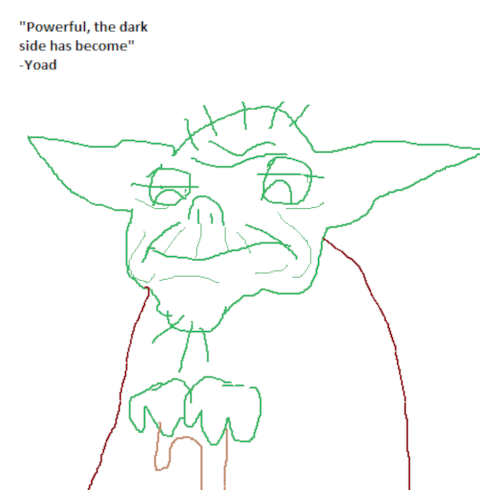

# What is R?

--

<center></center>

R is an open-source statistical analysis programming language

--

Lots of tools for many types of statistical analyses

--

Flexible, highly-customizable graphics

--

Become very popular in last ~10 years

---

# Why use R?

Personally, I prefer R but both have pros and cons:

--

.pull-left[

  ## Stata

  - Ready out-of-the-box
  - Pay-to-play: performance limited by pay tiers
  - Economists, sociologists, some epidemiologists (changing)
  - Better table creation functions
  - Stata is much friendlier for econometrics

]

--

.pull-right[

  ## R

  - Higher learning curve, more customizable
  - Free: performance only limited by your computer
  - Statisticians, data scientists
  - Miles better than Stata for graphs
  - Better tools for data cleaning
  
]

---

# Coding: general comments

--

<p style="color:#FF0000; font-size: 32px"> Learning a programming language is <b>not</b> like learning a foreign language </p>

--

I will assume you have <b>no</b> previous coding experience (if you don't, that's great!)

--

If you do have some previous experience:

--

- Stata is like SAS in some ways

--

- R is more like Python, it also might make sense if you've used SQL

--

Even if you don't like R, try to learn it: R is more like other languages than Stata is

---

# Let's install R!

We'll be downloading two things:

--

.pull-left[

  ## "Base" R
  
  
  
  This is the actual "language"
  
  <br/>
  Install R from [the R Project](https://cloud.r-project.org/)
  
]

.pull-right[

  ## R Studio
  
  
  
  We'll use this program to write R scripts
  
  Install from [R Studio](https://rstudio.com/products/rstudio/download/#download)
  
]

<br/>
<center><p style="color:#FF0000">Install base R first, <i>then</i> R Studio.</p></center>

---

# R Studio


---

# R Studio


<span style="color:#FF0000"><b>Source window</b></span>: where we'll write R code (scripts)

---

# R Studio


<span style="color:#FF0000"><b>Console window</b></span>: where R outputs will show when we run code

---

# R Studio


<span style="color:#FF0000"><b>Environment window</b></span>: lists the datasets we're using

---

# R Studio


<span style="color:#FF0000"><b>Miscellaneous window</b></span>: shows plots, folders, help pages, etc.

---

# Hello, world!

Try it out!

In the upper left-hand corner, click the <span style="color:green"><b>green</b></span> plus icon and pick "R Script"


--

In the new source window, type:

```{r eval=FALSE, tidy=FALSE}
print("Hello world!")
```

--

Then run it! Click to the left of the code (where the number 1 is) and:

- click `Run` on the source window, <i><b>or</b></i>
- hit `Ctrl+Enter`

---

# Hello, world!

Congrats, you just wrote an R script!

<center></center>

---

# How we use R

--

<center></center>

Think of <b>data</b> like <b>raw construction materials</b>

--

To build a house, we need <b>tools</b>: in R<sup>1</sup>, these are called <b>packages</b>

--

To store our <b>tools</b> we need a <b>toolbox</b>: in R<sup>1</sup>, this is called the <b>library</b>

--

To get our <b>tools</b>, we need to go to <b>Lowe's</b>: in R, this is called <b>CRAN</b><sup>2</sup>

</br>
.footnote[

[1] They're called packages and libraries in most languages, really

[2] The <b>C</b>omprehensive <b>R</b> <b>A</b>rchive <b>N</b>etwork

]

---

# Installing packages

<b>Tidyverse</b>: the most important package you'll use in R

<center></center>

--

The Tidyverse is a collection of packages created to help "tidy" up data for clean, efficient data analysis

--

All packages are stored on CRAN, but we can install them directly in R

To install the Tidyverse packages, type:

```{r eval=FALSE, tidy=FALSE}
install.packages("tidyverse")
```

Once it's installed, load the package:

```{r eval=FALSE, tidy=FALSE}
library(tidyverse)
```

---

# Installing packages

There are 16,000+ packages on CRAN: how do you know what they do?

--

All packages are vetted: R is open-source, but it's not Wikipedia

--

Still not sure? Check the help files!

```{r eval=FALSE, tidy=FALSE}
?tidyverse
```

--

Let's try another package:

```{r eval=FALSE, tidy=FALSE}
?print
```

--

But where do you go to look for packages?

--

.pull-left[

<center></center>

]

.pull-right[

<center></center>

]

---

# Datasets in R

"Join" in R = "merge" in Stata <i>but</i> R is way more flexible about merging

--

Let's get some data: **nyflights13** is a package with data for all flights departing NYC in 2013

```{r eval=FALSE, tidy=FALSE}
install.packages("nycflights13")
library(nycflights13)
```

Once it's installed, let's save two datasets from **nycflights13** to our R environment:

```{r eval=FALSE, tidy=FALSE}
a <- flights
b <- airlines
```

---

# Datasets in R

```{r eval=FALSE, tidy=FALSE}
a <- flights
b <- airlines
```

Some notes about what we just did:

--

- `flights` and `airlines` are <b>data frames</b>
  - Data frames (df) are what R calls datasets
  
--

- `<-` tells R to store something as an <b>object</b>
  - Objects can be data frames, vectors, lists, matrices, etc.
  
--

- `a` and `b` are what we're telling R to "save" the data as
  - We told R to put `flights` and `airlines` into our current environment and call them `a` and `b`

---

# Datasets in R

You should see `a` and `b` in the environment window. Let's look at them!

--

To view objects in R, just click on them or use `view()`:

```{r eval=FALSE, tidy=FALSE}
view(a)
view(b)
```

--

Until last year, you couldn't have two datasets open in Stata.

--

<b>ALWAYS</b> look at your data before joining - there might be problems you wouldn't notice if you just look at variable names and codebooks!

--

There's a `carrier` variable in `a` but it's not the airline's full name: let's use `b` to add the name!

---

# Joining datasets in R

One of the most common things you'll do with data: think about it first!

--

There are many types of joins in R, mostly in the Tidyverse package **dplyr**:

<center></center>

--

If we want to join a few airline names in `b` to many airline codes in `a`, which join should we do?

--

A left join!

---

# Joining datasets in R

To join two datasets, we need to tell R what we want to join and how we want to join it:

```{r eval=FALSE, tidy=FALSE}
left_join(a, b, by = "carrier")
```

--

This tells R to:

--

- Join `b` to `a`

--

- Join them by the common variable "carrier" (the two-letter airline codes)
  - The join-by variables in each df need to have the same name

--

<span style="color:green"><b>This does not change the original data!</b></span>

If we had done this in Stata, it would have changed `a`, the dataset we're joining `b` to. <span style="color:red"><b>This sucks if the join doesn't work like you thought it would!</b></span>

R is forgiving: if the join doesn't work, you can just fix it and try again!

---

# Joining datasets in R

Run the code: a preview prints to the console but `a` and `b` are unchanged.

--

Instead of permanently changing `a`, let's create a new object with the finished join called `c`:

```{r eval=FALSE, tidy=FALSE}
c <- left_join(a, b, by = "carrier")
```

If the join works correctly, `c` should look just like `a` but with one more variable that has airline names

--

Go look at `c`: it should have an airline name variable now!

--

<center></center>

---

# Cleaning up

How do we remove things from R? Use `rm()`

--

You can remove multiple items from R Studio using `rm()`:

```{r eval=FALSE, tidy=FALSE}
rm(a, b, c)
```

--

Or use the &#129529; icon to clean out everything

<center></center>

---

class: inverse

# Star Wars

<center></center>

Let's learn some more stuff with Star Wars

Download `starwars.csv` from my [Github page](https://raw.githubusercontent.com/i-baumann/R-Basics/master/starwars.csv?raw=true)

--

Open a new R script in R Studio

---

class: inverse

# Star Wars

## Scripting

Scripting is all about reproducibility

--

A .do file in Stata is a sequence of functions:
--
 so is a .R file in R!
 
--

Use the scripting window for scripting: avoid coding in the console
 
--

First, load packages:

```{r eval=FALSE, tidy=FALSE}
library(tidyverse)
```

--

Even if it's loaded in R now it might not be the next time!

---

class: inverse

# Star Wars

## Working directories

So far we've done everything inside the R Studio environment

--

As with most languages, including Stata, you'll be working out of a **working directory**: just a folder where things for a project live

--

Setting your wd in R Studio is easy:

--

In the miscellaneous window, click the `files` tab, then `...` in the top right corner, and navigate to where you saved `starwars.csv`

--

The folder will open in the window, then the &#9881; icon, and `set as working directory`

--

If you're comfortable with file pathing, you can also use `setwd()`:

```{r eval=FALSE, tidy=FALSE}
setwd("./Isaac/Example Star Wars Folder/")
```

---

class: inverse

# Star Wars

Like Stata, R can work with many types of data files (even Stata files!)

CSVs are common: base R can read them in but the Tidyverse's **readr** package is nice

--

`File -> Import Dataset -> From Text (readr)`

--

Use `browse` to find `starwars.csv` (**readr** will open in the wd you set)

--

<center></center>

---

class: inverse

# Star Wars

<center></center>

--

**readr** previews the data

--

The code box in the right bottom corner: you can copy or edit if you need to!

--

It will load **readr**, even if you don't have the Tidyverse loaded

--

Click `import`!

---

class: inverse

# Star Wars

**readr** will automatically put the df in `view` for you

--

Go ahead and look at the data

--

Let's find out how many planets are in `starwars`

--

In R, you select a column by name with a `$` or `["column name"]` after the df name:

```{r eval=FALSE, tidy=FALSE}
dataframe$column_name
dataframe["column_name"]
```

--

In `starwars` the planet variable/column is `homeworld`, so:

```{r eval=FALSE, tidy=FALSE}
starwars$homeworld
```

--

Not very helpful! R gives us the whole column!

---

class: inverse

# Star Wars

`unique()` to the rescue!

--

```{r eval=FALSE, tidy=FALSE}
unique(starwars$homeworld)
```

--

We can even alphabetize the vector using `sort()`:

```{r eval=FALSE, tidy=FALSE}
sort(unique(starwars$homeworld))
```

--

Say we're only interested in Tatooine: use **dplyr**'s `filter()` function to get only the Star Wars people from Tatooine:

```{r eval=FALSE, tidy=FALSE}
filter(starwars, homeworld == "Tatooine")
```

--

Like before, this doesn't change `starwars`!

We can overwrite `starwars` if we want to using `<-` or make our Tatooine filter into a new dataset.

---

class: inverse

# Star Wars

Can we explain differences in Star Wars characters' weights?

--

What might be some variables that affect weight?

--

Use `colnames()` or `ls()` to look at column/variable names in console:

```{r eval=FALSE, tidy=FALSE}
colnames(starwars)
ls(starwars)
```

--

Let's look at:

--

- `height`

--

- `homeworld`

--

- `species`

--

Let's use <i>regression</i> to check this out

---

class: inverse

# Star Wars

Use `lm()` (linear model) to do a linear regression in R

--

```{r eval=FALSE, tidy=FALSE}
lm(y ~ x, data = df_name)
```

--

- `y` is the response or dependent variable

--

- `x` is a regressor or independent variable

--

- `~` is like `=` (but only in `lm()`)

--

- `df_name` is the name of the data we're telling `lm()` to use

--

What's our `y`? What's our `x`(s)? What's our `df_name`?

--

In R it's usually a good idea to store regression results as objects so you don't have to re-run:

```{r eval=FALSE, tidy=FALSE}
model <- lm(mass ~ height + homeworld + species, data = starwars)
```

---

class: inverse

# Star Wars

Let's view the results!

--

```{r eval=FALSE, tidy=FALSE}
model
```

--

Not very useful...
--
 let's use `summary()`
  
```{r eval=FALSE, tidy=FALSE}
summary(model)
```

--

Much more useful!

--

Questions:

- What's significant?

--

- Why is only one planet very significant?

--

- Why are most of the species coefficients `NA`?

---

class: inverse

# Star Wars

## Data visualization

--

Base R has some _basic_ graphic tools

--

Mostly good for quick and dirty data visualization

--

`plot` and `hist` are good for basic scatterplots and histograms

--

### Scatterplots in base R

```{r eval=FALSE, tidy=FALSE}
plot("first variable","second variable")
```

--

Let's look at `mass` and `height` in a scatterplot:

```{r eval=FALSE, tidy=FALSE}
plot(starwars$mass,starwars$height)
```

---

class: inverse

# Star Wars

## Data visualization

### Histograms in base R

Histograms are frequency plots: they tell us how many times a value appears

--

```{r eval=FALSE, tidy=FALSE}
hist("variable",breaks = "how many bars we want")
```

--

Let's make a histogram of Star Wars characters' weights:

```{r eval=FALSE, tidy=FALSE}
hist(starwars$mass)
```

--

More detailed:

```{r eval=FALSE, tidy=FALSE}
hist(starwars$mass, breaks = 100)
```

---

class: inverse

# Star Wars

## Data visualization

<br/>
<center></center>

---

class: inverse

# Star Wars

## Data visualization

.pull-left[

Base R plots:



]

--

.pull-right[

ggplot2 plots:
<br/><br/><br/><br/>


]

---

class: inverse

# Star Wars

## Data visualization: ggplot2

<center></center>

ggplot2 is _another_ Tidyverse package

--

Highly customizable, but tough to get used to

--

Can take a lot of coding: many, many functions for adding layers, editing labels, etc.

--

Easily pass data to ggplot2 functions

---

class: inverse

# Star Wars

## Data visualization: ggplot2

The idea behind ggplot2 is you build graphics by:

--


---


Install the **xaringan** package from [Github](https://github.com/yihui/xaringan):

```{r eval=FALSE, tidy=FALSE}
devtools::install_github("yihui/xaringan")
```

--

You are recommended to use the [RStudio IDE](https://www.rstudio.com/products/rstudio/), but you do not have to.

- Create a new R Markdown document from the menu `File -> New File -> R Markdown -> From Template -> Ninja Presentation`;<sup>1</sup>

--

- Click the `Knit` button to compile it;

--

- or use the [RStudio Addin](https://rstudio.github.io/rstudioaddins/)<sup>2</sup> "Infinite Moon Reader" to live preview the slides (every time you update and save the Rmd document, the slides will be automatically reloaded in RStudio Viewer.

.footnote[
[1] 中文用户请看[这份教程](http://slides.yihui.org/xaringan/zh-CN.html)

[2] See [#2](https://github.com/yihui/xaringan/issues/2) if you do not see the template or addin in RStudio.
]

---
background-image: url(`r xaringan:::karl`)
background-position: 50% 50%
class: center, bottom, inverse

# You only live once!

---

# Hello Ninja

As a presentation ninja, you certainly should not be satisfied by the "Hello World" example. You need to understand more about two things:

1. The [remark.js](https://remarkjs.com) library;

1. The **xaringan** package;

Basically **xaringan** injected the chakra of R Markdown (minus Pandoc) into **remark.js**. The slides are rendered by remark.js in the web browser, and the Markdown source needed by remark.js is generated from R Markdown (**knitr**).

---

# remark.js

You can see an introduction of remark.js from [its homepage](https://remarkjs.com). You should read the [remark.js Wiki](https://github.com/gnab/remark/wiki) at least once to know how to

- create a new slide (Markdown syntax<sup>*</sup> and slide properties);

- format a slide (e.g. text alignment);

- configure the slideshow;

- and use the presentation (keyboard shortcuts).

It is important to be familiar with remark.js before you can understand the options in **xaringan**.

.footnote[[*] It is different with Pandoc's Markdown! It is limited but should be enough for presentation purposes. Come on... You do not need a slide for the Table of Contents! Well, the Markdown support in remark.js [may be improved](https://github.com/gnab/remark/issues/142) in the future.]

---
background-image: url(`r xaringan:::karl`)
background-size: cover
class: center, bottom, inverse

# I was so happy to have discovered remark.js!

---
class: inverse, middle, center

# Using xaringan

---

# xaringan

Provides an R Markdown output format `xaringan::moon_reader` as a wrapper for remark.js, and you can use it in the YAML metadata, e.g.

```yaml
---
title: "A Cool Presentation"
output:
  xaringan::moon_reader:
    yolo: true
    nature:
      autoplay: 30000
---
```

See the help page `?xaringan::moon_reader` for all possible options that you can use.

---

# remark.js vs xaringan

Some differences between using remark.js (left) and using **xaringan** (right):

.pull-left[
1. Start with a boilerplate HTML file;

1. Plain Markdown;

1. Write JavaScript to autoplay slides;

1. Manually configure MathJax;

1. Highlight code with `*`;

1. Edit Markdown source and refresh browser to see updated slides;
]

.pull-right[
1. Start with an R Markdown document;

1. R Markdown (can embed R/other code chunks);

1. Provide an option `autoplay`;

1. MathJax just works;<sup>*</sup>

1. Highlight code with `{{}}`;

1. The RStudio addin "Infinite Moon Reader" automatically refreshes slides on changes;
]

.footnote[[*] Not really. See next page.]

---

# Math Expressions

You can write LaTeX math expressions inside a pair of dollar signs, e.g. &#36;\alpha+\beta$ renders $\alpha+\beta$. You can use the display style with double dollar signs:

```
$$\bar{X}=\frac{1}{n}\sum_{i=1}^nX_i$$
```

$$\bar{X}=\frac{1}{n}\sum_{i=1}^nX_i$$

Limitations:

1. The source code of a LaTeX math expression must be in one line, unless it is inside a pair of double dollar signs, in which case the starting `$$` must appear in the very beginning of a line, followed immediately by a non-space character, and the ending `$$` must be at the end of a line, led by a non-space character;

1. There should not be spaces after the opening `$` or before the closing `$`.

1. Math does not work on the title slide (see [#61](https://github.com/yihui/xaringan/issues/61) for a workaround).

---

# R Code

```{r comment='#'}
# a boring regression
fit = lm(dist ~ 1 + speed, data = cars)
coef(summary(fit))
dojutsu = c('地爆天星', '天照', '加具土命', '神威', '須佐能乎', '無限月読')
grep('天', dojutsu, value = TRUE)
```

---

# R Plots

```{r cars, fig.height=4, dev='svg'}
par(mar = c(4, 4, 1, .1))
plot(cars, pch = 19, col = 'darkgray', las = 1)
abline(fit, lwd = 2)
```

---

# Tables

If you want to generate a table, make sure it is in the HTML format (instead of Markdown or other formats), e.g.,

```{r}
knitr::kable(head(iris), format = 'html')
```

---

# HTML Widgets

I have not thoroughly tested HTML widgets against **xaringan**. Some may work well, and some may not. It is a little tricky.

Similarly, the Shiny mode (`runtime: shiny`) does not work. I might get these issues fixed in the future, but these are not of high priority to me. I never turn my presentation into a Shiny app. When I need to demonstrate more complicated examples, I just launch them separately. It is convenient to share slides with other people when they are plain HTML/JS applications.

See the next page for two HTML widgets.

---

```{r out.width='100%', fig.height=6, eval=require('leaflet')}
library(leaflet)
leaflet() %>% addTiles() %>% setView(-93.65, 42.0285, zoom = 17)
```

---

```{r eval=require('DT'), tidy=FALSE}
DT::datatable(
  head(iris, 10),
  fillContainer = FALSE, options = list(pageLength = 8)
)
```

---

# Some Tips

- When you use the "Infinite Moon Reader" addin in RStudio, your R session will be blocked by default. You can click the red button on the right of the console to stop serving the slides, or use the _daemonized_ mode so that it does not block your R session. To do the latter, you can set the option

    ```r
    options(servr.daemon = TRUE)
    ```
    
    in your current R session, or in `~/.Rprofile` so that it is applied to all future R sessions. I do the latter by myself.
    
    To know more about the web server, see the [**servr**](https://github.com/yihui/servr) package.

--

- Do not forget to try the `yolo` option of `xaringan::moon_reader`.

    ```yaml
    output:
      xaringan::moon_reader:
        yolo: true
    ```

---

# Some Tips

- Slides can be automatically played if you set the `autoplay` option under `nature`, e.g. go to the next slide every 30 seconds in a lightning talk:

    ```yaml
    output:
      xaringan::moon_reader:
        nature:
          autoplay: 30000
    ```

--

- A countdown timer can be added to every page of the slides using the `countdown` option under `nature`, e.g. if you want to spend one minute on every page when you give the talk, you can set:

    ```yaml
    output:
      xaringan::moon_reader:
        nature:
          countdown: 60000
    ```

    Then you will see a timer counting down from `01:00`, to `00:59`, `00:58`, ... When the time is out, the timer will continue but the time turns red.
    
---

# Some Tips

- The title slide is created automatically by **xaringan**, but it is just another remark.js slide added before your other slides.

    The title slide is set to `class: center, middle, inverse, title-slide` by default. You can change the classes applied to the title slide with the `titleSlideClass` option of `nature` (`title-slide` is always applied).

    ```yaml
    output:
      xaringan::moon_reader:
        nature:
          titleSlideClass: [top, left, inverse]
    ```
    
--

- If you'd like to create your own title slide, disable **xaringan**'s title slide with the `seal = FALSE` option of `moon_reader`.

    ```yaml
    output:
      xaringan::moon_reader:
        seal: false
    ```

---

# Some Tips

- There are several ways to build incremental slides. See [this presentation](https://slides.yihui.org/xaringan/incremental.html) for examples.

- The option `highlightLines: true` of `nature` will highlight code lines that start with `*`, or are wrapped in `{{ }}`, or have trailing comments `#<<`;

    ```yaml
    output:
      xaringan::moon_reader:
        nature:
          highlightLines: true
    ```

    See examples on the next page.

---

# Some Tips


.pull-left[
An example using a leading `*`:

    ```r
    if (TRUE) {
    ** message("Very important!")
    }
    ```
Output:
```r
if (TRUE) {
* message("Very important!")
}
```

This is invalid R code, so it is a plain fenced code block that is not executed.
]

.pull-right[
An example using `{{}}`:

````
`r ''````{r tidy=FALSE}
if (TRUE) {
*{{ message("Very important!") }}
}
```
````
Output:
```{r tidy=FALSE}
if (TRUE) {
{{ message("Very important!") }}
}
```

It is valid R code so you can run it. Note that `{{}}` can wrap an R expression of multiple lines.
]

---

# Some Tips

An example of using the trailing comment `#<<` to highlight lines:

````markdown
`r ''````{r tidy=FALSE}
library(ggplot2)
ggplot(mtcars) + 
  aes(mpg, disp) + 
  geom_point() +   #<<
  geom_smooth()    #<<
```
````

Output:

```{r tidy=FALSE, eval=FALSE}
library(ggplot2)
ggplot(mtcars) + 
  aes(mpg, disp) + 
  geom_point() +   #<<
  geom_smooth()    #<<
```

---

# Some Tips

When you enable line-highlighting, you can also use the chunk option `highlight.output` to highlight specific lines of the text output from a code chunk. For example, `highlight.output = TRUE` means highlighting all lines, and `highlight.output = c(1, 3)` means highlighting the first and third line.

````md
`r ''````{r, highlight.output=c(1, 3)}
head(iris)
```
````

```{r, highlight.output=c(1, 3), echo=FALSE}
head(iris)
```

Question: what does `highlight.output = c(TRUE, FALSE)` mean? (Hint: think about R's recycling of vectors)

---

# Some Tips

- To make slides work offline, you need to download a copy of remark.js in advance, because **xaringan** uses the online version by default (see the help page `?xaringan::moon_reader`).

- You can use `xaringan::summon_remark()` to download the latest or a specified version of remark.js. By default, it is downloaded to `libs/remark-latest.min.js`.

- Then change the `chakra` option in YAML to point to this file, e.g.

    ```yaml
    output:
      xaringan::moon_reader:
        chakra: libs/remark-latest.min.js
    ```

- If you used Google fonts in slides (the default theme uses _Yanone Kaffeesatz_, _Droid Serif_, and _Source Code Pro_), they won't work offline unless you download or install them locally. The Heroku app [google-webfonts-helper](https://google-webfonts-helper.herokuapp.com/fonts) can help you download fonts and generate the necessary CSS.

---

# Macros

- remark.js [allows users to define custom macros](https://github.com/yihui/xaringan/issues/80) (JS functions) that can be applied to Markdown text using the syntax `![:macroName arg1, arg2, ...]` or ``. For example, before remark.js initializes the slides, you can define a macro named `scale`:

    ```js
    remark.macros.scale = function (percentage) {
      var url = this;
      return '';
    };
    ```

    Then the Markdown text

    ```markdown
    
    ```

    will be translated to
    
    ```html
    
    ```

---

# Macros (continued)

- To insert macros in **xaringan** slides, you can use the option `beforeInit` under the option `nature`, e.g.,

    ```yaml
    output:
      xaringan::moon_reader:
        nature:
          beforeInit: "macros.js"
    ```

    You save your remark.js macros in the file `macros.js`.

- The `beforeInit` option can be used to insert arbitrary JS code before `remark.create()`. Inserting macros is just one of its possible applications.

---

# CSS

Among all options in `xaringan::moon_reader`, the most challenging but perhaps also the most rewarding one is `css`, because it allows you to customize the appearance of your slides using any CSS rules or hacks you know.

You can see the default CSS file [here](https://github.com/yihui/xaringan/blob/master/inst/rmarkdown/templates/xaringan/resources/default.css). You can completely replace it with your own CSS files, or define new rules to override the default. See the help page `?xaringan::moon_reader` for more information.

---

# CSS

For example, suppose you want to change the font for code from the default "Source Code Pro" to "Ubuntu Mono". You can create a CSS file named, say, `ubuntu-mono.css`:

```css
@import url(https://fonts.googleapis.com/css?family=Ubuntu+Mono:400,700,400italic);

.remark-code, .remark-inline-code { font-family: 'Ubuntu Mono'; }
```

Then set the `css` option in the YAML metadata:

```yaml
output:
  xaringan::moon_reader:
    css: ["default", "ubuntu-mono.css"]
```

Here I assume `ubuntu-mono.css` is under the same directory as your Rmd.

See [yihui/xaringan#83](https://github.com/yihui/xaringan/issues/83) for an example of using the [Fira Code](https://github.com/tonsky/FiraCode) font, which supports ligatures in program code.

---

# Themes

Don't want to learn CSS? Okay, you can use some user-contributed themes. A theme typically consists of two CSS files `foo.css` and `foo-fonts.css`, where `foo` is the theme name. Below are some existing themes:

```{r}
names(xaringan:::list_css())
```

---

# Themes

To use a theme, you can specify the `css` option as an array of CSS filenames (without the `.css` extensions), e.g.,

```yaml
output:
  xaringan::moon_reader:
    css: [default, metropolis, metropolis-fonts]
```

If you want to contribute a theme to **xaringan**, please read [this blog post](https://yihui.org/en/2017/10/xaringan-themes).

---
class: inverse, middle, center
background-image: url(https://upload.wikimedia.org/wikipedia/commons/3/39/Naruto_Shiki_Fujin.svg)
background-size: contain

# Naruto

---
background-image: url(https://upload.wikimedia.org/wikipedia/commons/b/be/Sharingan_triple.svg)
background-size: 100px
background-position: 90% 8%

# Sharingan

The R package name **xaringan** was derived<sup>1</sup> from **Sharingan**, a dōjutsu in the Japanese anime _Naruto_ with two abilities:

- the "Eye of Insight"

- the "Eye of Hypnotism"

I think a presentation is basically a way to communicate insights to the audience, and a great presentation may even "hypnotize" the audience.<sup>2,3</sup>

.footnote[
[1] In Chinese, the pronounciation of _X_ is _Sh_ /ʃ/ (as in _shrimp_). Now you should have a better idea of how to pronounce my last name _Xie_.

[2] By comparison, bad presentations only put the audience to sleep.

[3] Personally I find that setting background images for slides is a killer feature of remark.js. It is an effective way to bring visual impact into your presentations.
]

---

# Naruto terminology

The **xaringan** package borrowed a few terms from Naruto, such as

- [Sharingan](http://naruto.wikia.com/wiki/Sharingan) (写輪眼; the package name)

- The [moon reader](http://naruto.wikia.com/wiki/Moon_Reader) (月読; an attractive R Markdown output format)

- [Chakra](http://naruto.wikia.com/wiki/Chakra) (查克拉; the path to the remark.js library, which is the power to drive the presentation)

- [Nature transformation](http://naruto.wikia.com/wiki/Nature_Transformation) (性質変化; transform the chakra by setting different options)

- The [infinite moon reader](http://naruto.wikia.com/wiki/Infinite_Tsukuyomi) (無限月読; start a local web server to continuously serve your slides)

- The [summoning technique](http://naruto.wikia.com/wiki/Summoning_Technique) (download remark.js from the web)

You can click the links to know more about them if you want. The jutsu "Moon Reader" may seem a little evil, but that does not mean your slides are evil.

---

class: center

# Hand seals (印)

Press `h` or `?` to see the possible ninjutsu you can use in remark.js.


---

class: center, middle

# Thanks!

Slides created via the R package [**xaringan**](https://github.com/yihui/xaringan).

The chakra comes from [remark.js](https://remarkjs.com), [**knitr**](http://yihui.org/knitr), and [R Markdown](https://rmarkdown.rstudio.com).
